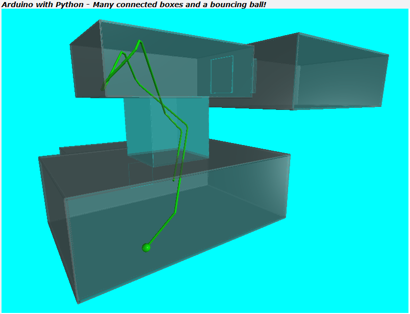

# TTB-AP-Lesson15
My Solution to Paul McWhorter's "Arduino with Python: LESSON 15" homework.

Visit Paul's video here:
 - https://youtu.be/watch?v=1qNnMjw_KxM

You can get Paul's code here:
 - https://toptechboy.com/

You can see my solution demonstrated here:
 - https://youtu.be/B7KxOqdNP8E

This week it is again all about the python code and emphasising the parametric design. I now have four boxes, or arenas, all with linking tunnels. There is now a single ball bouncing around, and it is free to move between the arenas via the linking tunnels. All this is again essentially from 2 parameters, an arena position and size. Everything else is relative, especially the tunnels that links the arenas.

...and I have solved last weeks problem to do with the bouncing and collision detection code and the ball having a radius!

## My Connected Boxes with a Bouncing Ball - Parameterised:

